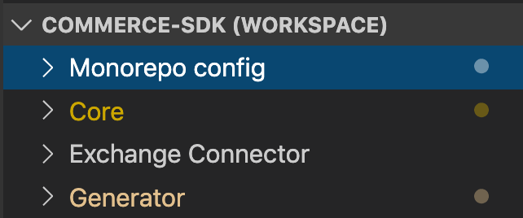
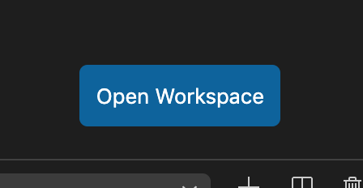

# Using VSCODE

## Multi-Workspace Project

At the root of the project you will find a `commerce-sdk.code-workspace` file, which includes some basic configuration settings to setup a multi-workspace project within vscode.

This will organize the packages within vscode like the following
​


If the workspace bar on the left does not look like this there are a couple of ways to open vscode in it's multi-workspace mode.

1) You can open it via the cli `$ code commerce-sdk.code-workspace`.
2) Open the `commerce-sdk.code-workspace` in vscode, there is a button in the lower right to open that workspace directly.
  


"Monorepo config" represents the files at the root of the folder that let you configure or run the commands in the monorepo itself.

Each other workspace corresponds directly with the lerna packages of the same name.

## Launch Configurations

VSCode lets you define launch configurations via JSON.  See examples below to get started.

> NOTE: The below configurations will only work in a multi-workspace otherwise ${workspaceFolder} will point to the root of the project and not the root of the workspace
        
### Debugging the Generator

The exchange-connector and core don't have any logic when you build them.  If you want to debug those you should write a test and use the below example for debugging tests.

The generator however is unique in that the build itself has a lot of logic in it depending on the input.  (Different RAML produces different results) So often you will need to debug the actual build of the generator.  

> NOTE: Core and Exchange-connector must already be built for these to work

```json
{
    "type": "node",
    "request": "launch",
    "name": "Gulp task (Local files)",
    "program": "${workspaceFolder}/node_modules/gulp/bin/gulp.js",
    "args": [
        "renderTemplates"
    ],
    "skipFiles": [
        "<node_internals>/**"
    ]
}
```

Note that we are running gulp directly.  This is because when debugging you most likely want to execute the minimum amount of code needed for your testing.  This allows you to target exact tasks to debug them.

What if you want to troubleshoot a part of the rendering that is happening when downloading the apis from exchange? It's simple to add a launch configuration for that as well.

```json
    {
        "type": "node",
        "request": "launch",
        "name": "Gulp task (Download Files)",
        "env": {
            "EXCHANGE_DOWNLOAD": "1"
        },
        "envFile": "${workspaceFolder}/.env",
        "program": "${workspaceFolder}/node_modules/gulp/bin/gulp.js",
        "args": [
            "renderTemplates"
        ],
        "skipFiles": [
            "<node_internals>/**"
        ]
    }
```

As long as you have a .env with your credentials for Exchange, this will now download from Exchange and let you step through to debug as well.


### Debugging Tests

Sometimes you need to debug what a test is doing. This can be accomplished by adding the example below as a workspace config to any workspace.

Specifically, this allows you to debug a single test file easily and add breakpoints and/or watches within the test file.

```json
{
    "type": "node",
    "request": "launch",
    "name": "Debug tests for current file",
    "runtimeExecutable": "npx",
    "runtimeArgs": [
        "cross-env",
        "mocha",
        "-r",
        "ts-node/register",
        "--timeout",
        "999999",
        "--colors",
        "${file}"
    ],
    "console": "integratedTerminal",
    "internalConsoleOptions": "neverOpen",
    "protocol": "inspector",
    "cwd": "${workspaceFolder}"
}  
```

See [Debugging](https://code.visualstudio.com/docs/editor/debugging) for details on debugging in VSCODE. 
